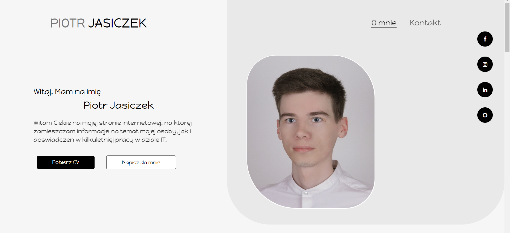

# My Own Website
> This repository contains code of my own website page placed on [www.piotrjasiczek.pl](http://www.piotrjasiczek.pl), where you can read more about my experience in IT.

## Table of contents
* [General info](#general-info)
* [Screenshots](#screenshots)
* [Technologies](#technologies)
* [Features](#features)
* [Status](#status)
* [Contact](#contact)

## General info
This page was created as a portfolio showing the current possibilities in the field of web design. It is one of the first pages created by me and as a result of writing a few of them. I know that I want to develop in this direction.

## Screenshots

## Technologies
* HTML 5 
* CSS 3
* JavaScript

## Features
To-do list:
* Better customization of the site for mobile devices

## Status
Project is: _in progress_

## Contact
Created by [@PJasiczek](http://www.piotrjasiczek.pl/) - feel free to contact me!
